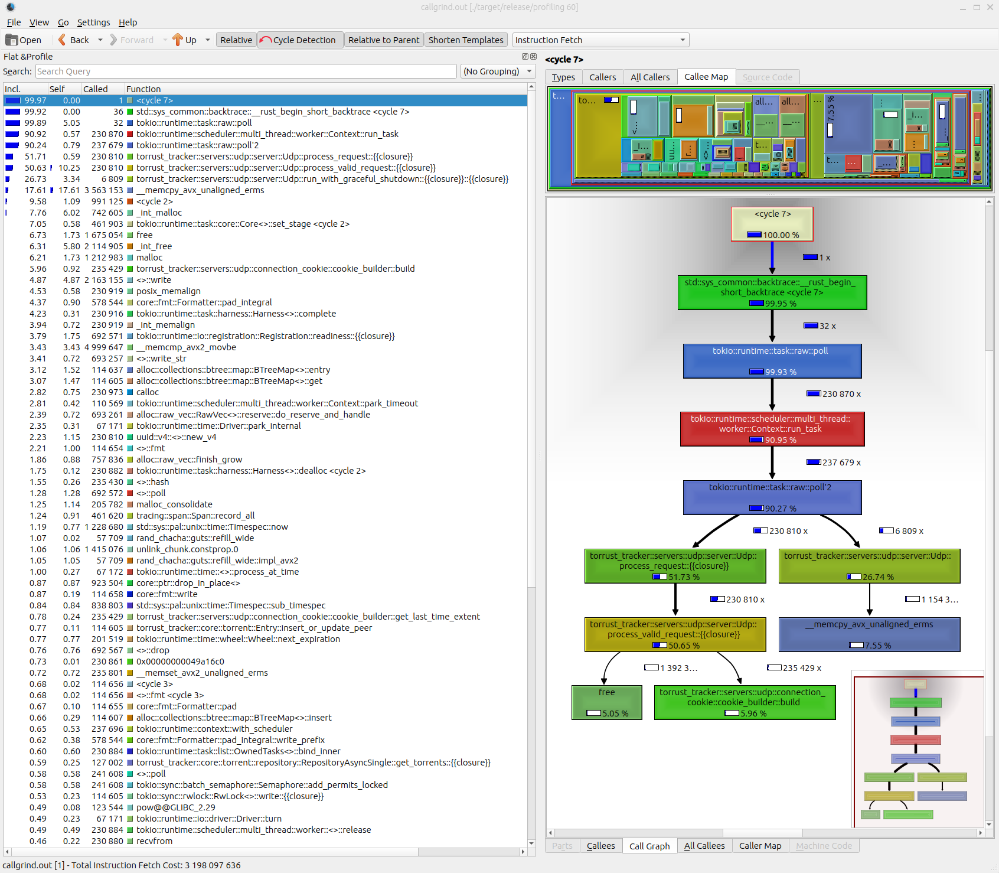

# Profiling

## Using flamegraph

```console
TORRUST_TRACKER_PATH_CONFIG="./share/default/config/tracker.udp.benchmarking.toml" cargo flamegraph --bin=profiling -- 60
```


## Using valgrind and kcachegrind

You need to:

1. Build an run the tracker for profiling.
2. Make requests to the tracker while it's running.

Build and the binary for profiling:

```console
RUSTFLAGS='-g' cargo build --release --bin profiling \
   && export TORRUST_TRACKER_PATH_CONFIG="./share/default/config/tracker.udp.benchmarking.toml" \
   && valgrind \
     --tool=callgrind \
     --callgrind-out-file=callgrind.out \
     --collect-jumps=yes \
     --simulate-cache=yes \
     ./target/release/profiling 60
```

> NOTICE: You should make requests to the services you want to profile. For example, using the [UDP load test](./benchmarking.md#run-udp-load-test).

After running the tracker with `<valgrind` it generates a file `callgrind.out`
that you can open with `kcachegrind`.

```console
kcachegrind callgrind.out
```



## Links

Profiling tools:

- [valgrind](https://valgrind.org/).
- [kcachegrind](https://kcachegrind.github.io/).
- [flamegraph](https://github.com/flamegraph-rs/flamegraph).

Talks about profiling:

- [Profiling Rust Programs with valgrind, heaptrack, and hyperfine](https://www.youtube.com/watch?v=X6Xz4CRd6kw&t=191s).
- [RustConf 2023 - Profiling async applications in Rust by Vitaly Bragilevsky](https://www.youtube.com/watch?v=8FAdY_0DpkM).
- [Profiling Code in Rust - by Vitaly Bragilevsky - Rust Linz, December 2022](https://www.youtube.com/watch?v=JRMOIE_wAFk&t=8s).
- [Xdebug 3 Profiling: 2. KCachegrind tour](https://www.youtube.com/watch?v=h-0HpCblt3A).

## Acknowledgments

Many thanks to [Vitaly Bragilevsky](https://github.com/bravit) and others for sharing the talks about profiling.
